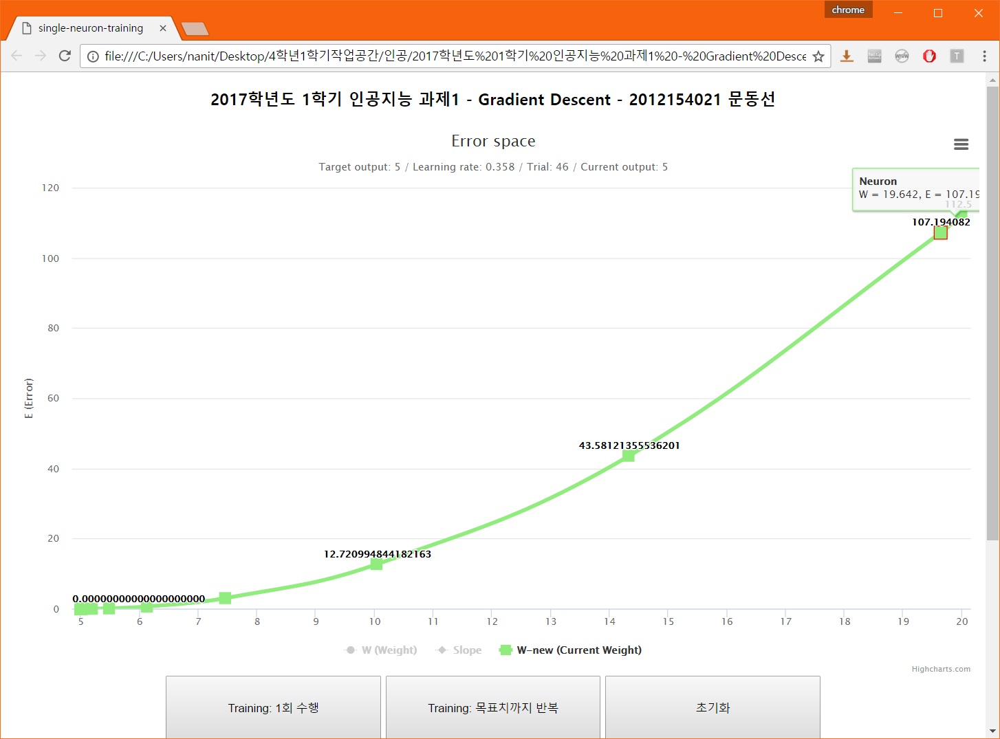
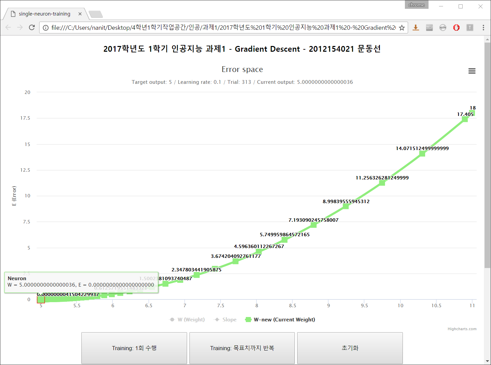
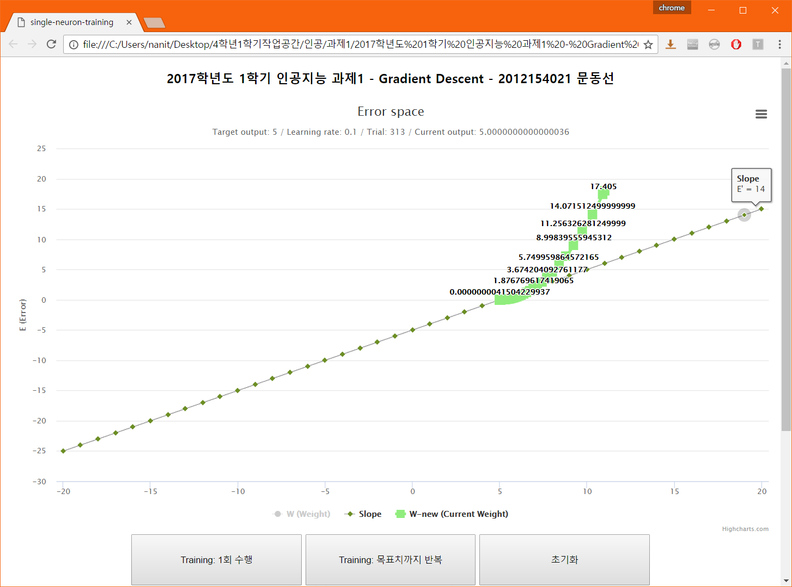
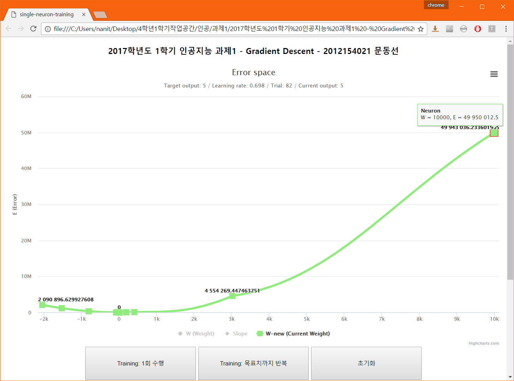

# Single-Neuron-Training-using-Gradient-Descent

## 개요
- 2017학년도 4학년 1학기 `인공지능` 수업 과제

## 세부사항
- 뉴런 하나를 트레이닝하는 프로그램을 작성한다.
- 뉴런은 1의 값을 입력으로 받으며, 목표 출력값은 5다.
- 활성화 함수는 시그모이드(Sigmoid) 함수가 아닌 `g(x) = x`라고 가정한다.
- `Gradient descent` 방법을 이용하여 뉴런을 학습시키고 최적의 가중치(Weight)를 찾아야 한다.
- `Error space`를 플롯으로 표현할 것.

## 실행화면

